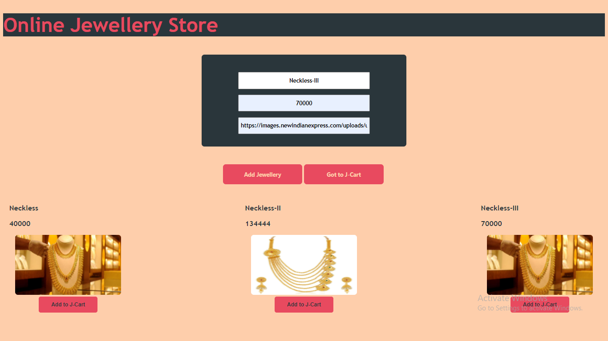
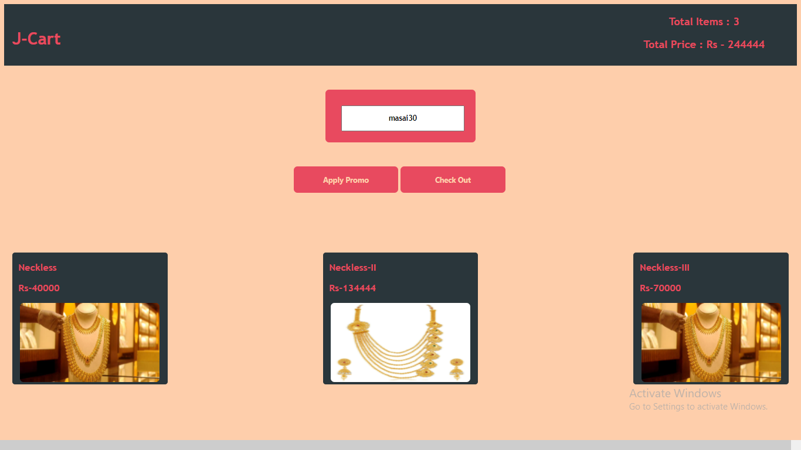
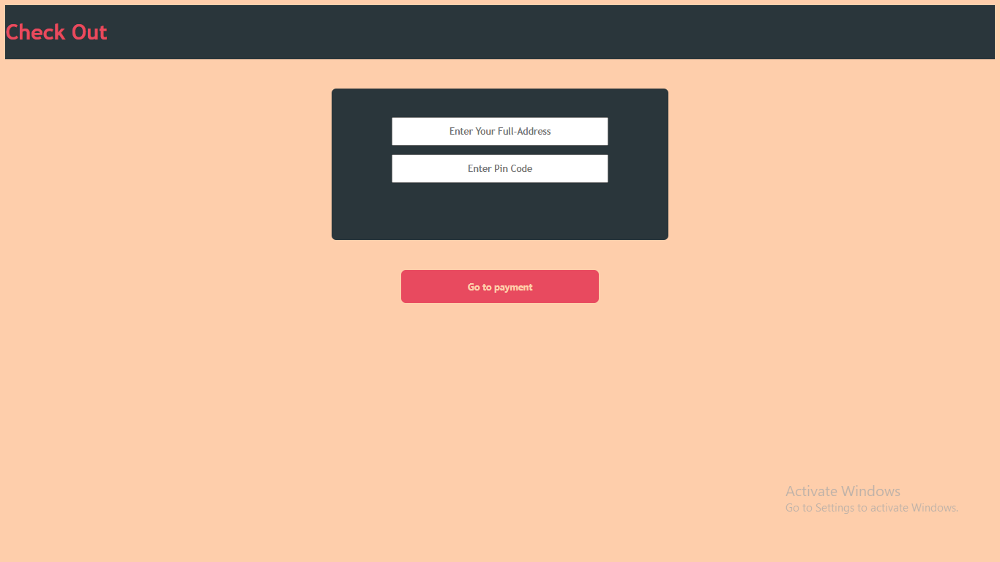
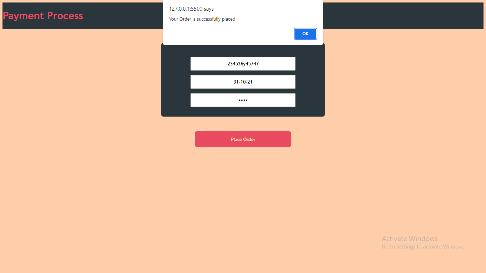

# 

## For Demo
#### Click here <a href="https://mrrupendra.github.io/MyDomProject/">Demo</a>

#

##### It's an Online-Jewellery website which is used to add and purchase jewellery items.It is build by using HTML, CSS and JS. 

## Tech stacks used: 
##### To create this Website following Tech stack is used by contributors.

### - HTML
### - CSS
### - JAVA-SCRIPT
### - Local-Storage

#

## INDEX PAGE :
##### The Index Page of Online-Jewellery-Shop website where you add jewellery items along with price , name and images.

#

## ADD PRODUCT PAGE :
#####  This the page where you can see the jewellery items are added.

#

## CART PAGE:
##### This is the page where you can see the items or products are added to the cart and also you can apply promo code in this cart page. 

## CHECKOUT PAGES :
##### Checkout page where you need to add your address details.

## PAYMENT PAGE
##### In this page you need to fill the the payment details with pass code and need to click the payment button and then your item is successfully purchased and you redirect to the index page.

#

## PRODUCT PAGES & KEY FEATURES :
### There are some Key Features which are added in website such as :
##### Cart 
##### All Data stored in Local-Storage.
##### Coupon Application feature.
##### Payment.

#

### Rupendra Singh
- *Github* : https://github.com/Mrrupendra/ 
- *Email* : mr.rupendra11@gmail.com
- *Linkedin* : https://www.linkedin.com/in/rupendra-singh-6430ab16a/

